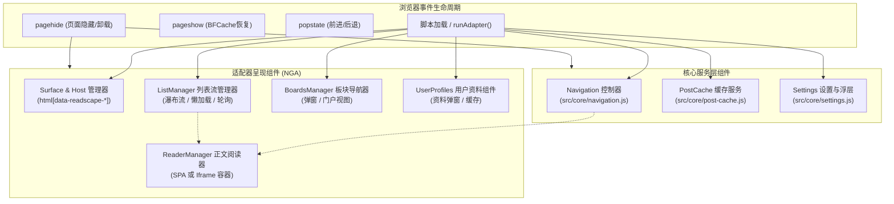
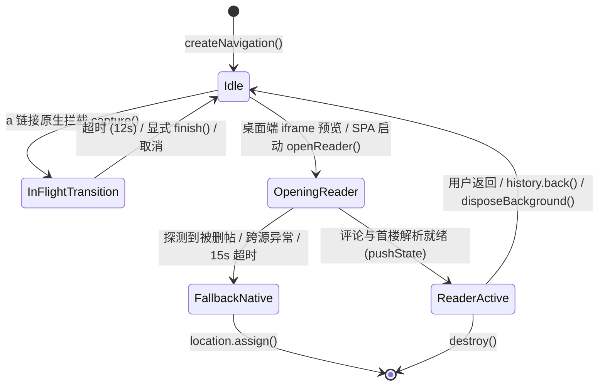
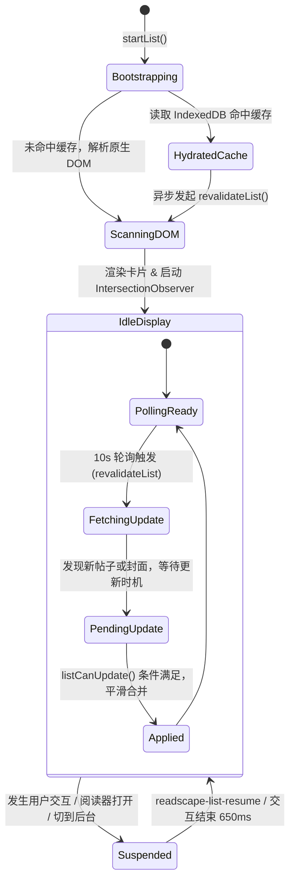
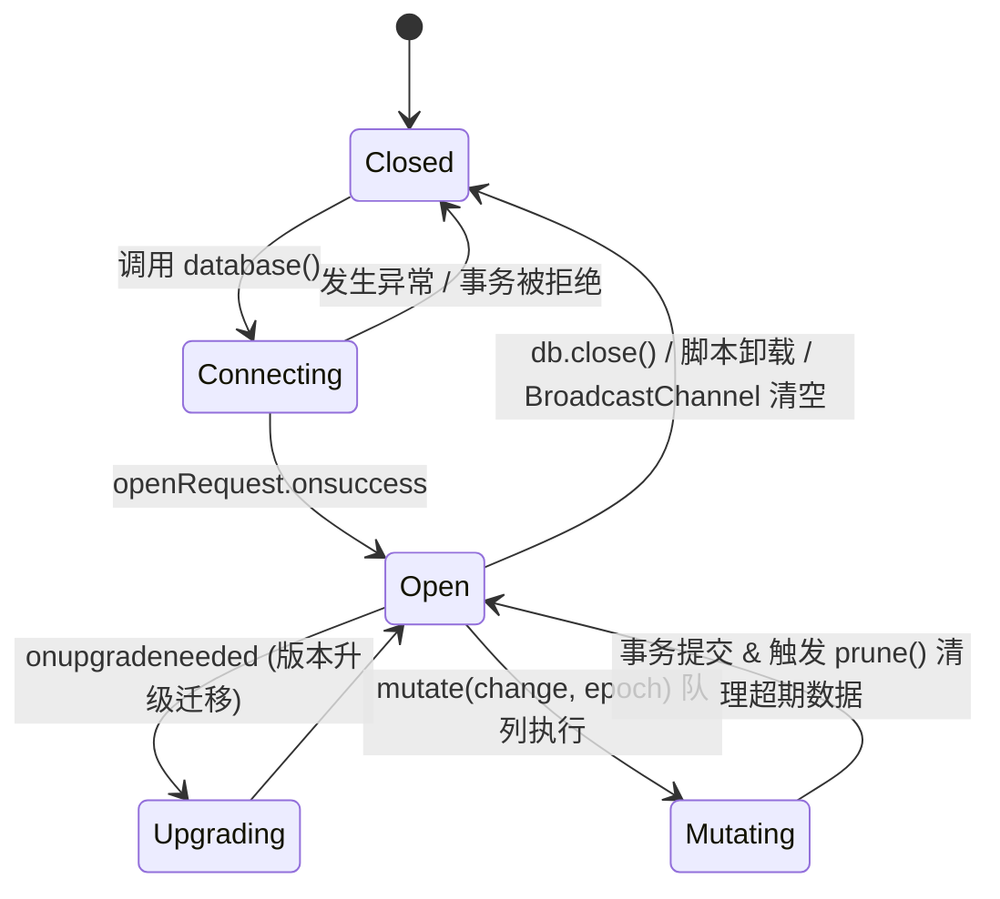

# 组件生命周期与状态流转规范

本文档系统定义阅境（Readscape）核心内核与适配器各组件的完整生命周期、状态机流转、资源销毁与跨组件时序协同规范。开发与扩展新功能时，必须严格遵守本规范，确保各组件在初始化、运行交互、路由过渡及页面卸载各阶段符合需求与无泄漏标准。

---

## 1. 架构总览与组件生命周期全景

阅境采用「宿主轻量侵入 + Shadow DOM 前景隔离 + 独立状态流转」架构。各核心组件的生命周期与职责边界如下：



---

## 2. 核心组件生命周期状态机

### 2.1 Navigation 导航控制器 (`src/core/navigation.js`)

Navigation 负责控制页面跳转遮罩（Veil）、桌面端 Background Iframe 容器、SPA 路由转发以及历史栈状态绑定。

#### 状态流转图


#### 关键约束与时序要求：
1. **全局唯一单例约束**：任意时刻后台仅允许存在一个活动的 `background` 阅读容器。再次调用 `openReader` 时必须首先调用 `disposeBackground()` 清理旧容器与定时器。
2. **滚动恢复安全隔离**：
   - 打开阅读容器前：必须记录列表容器或视口当前滚动位置 `listScroll` / `documentScroll`，并将列表设置为 `inert = true` 与 `visibility = 'hidden'`。
   - 关闭阅读容器时（`disposeBackground`）：先恢复 `list.visibility`、`list.inert`，重设 `history.scrollRestoration`，精确还原 `scrollTo`，最后派发 `readscape-list-resume` 事件唤醒列表更新。
3. **焦点保护**：打开前必须记录唤起元素 `initialFocus`（如触发卡片的 Cover 链接）；关闭时必须安全地把焦点归还到 `opener.focus({ preventScroll: true })`，若节点脱离文档则降级归还至列表容器。
4. **生命周期清理方法 `destroy()`**：
   - 必须注销 `document.removeEventListener('click', capture)` 与 `window.removeEventListener('popstate', onPopState)`。
   - 必须停止轮询定时器（`clearInterval`）、超时定时器（`clearTimeout`），移除 `iframe` 和状态提示条 `notice`。

---

### 2.2 列表瀑布流组件 (`src/adapters/nga/list.js` & `index.js`)

列表组件承载了网络扫描、增量瀑布流、排版布局、手势下拉刷新以及 10 秒自动轮询。

#### 状态流转与轮询守卫


#### 关键生命周期规范：
1. **更新守卫 `listCanUpdate()`**：
   在任何卡片重排、封面回填或新页合流执行前，必须确保满足全部守卫条件：
   ```js
   !coverDisposed && !app.hidden && !document.hidden &&
   !readerCoversList() && !listPointers.size && !pullStart &&
   !listBusy && !app.classList.contains('rt-settings-open') &&
   Date.now() - listActivityAt >= 650
   ```
   只要用户正在触摸屏幕、正在滚动、正在设置面板中操作或正处于阅读模式，卡片几何尺寸**绝对不能突变**，必须暂存到 `pendingListPage` 或 `pendingListCovers`，待空闲时合并。
2. **滚动位置防夹回与恢复**：
   - 当列表首次从 IndexedDB 异步渲染时，浏览器原生滚动恢复可能因页面高度尚未建立而被强制截断至顶部。
   - 必须通过 `sessionStorage` 记录 `${KEY}-scroll-${streamKey}#${page}`，并在 `restoreListScroll()` 中轮询检测高度（最多 50 次，每次 60ms），卡片撑开后精确恢复。
   - 只要用户发生任一原生交互（`wheel`, `touchstart`, `pointerdown`, `keydown`），必须立刻调用 `cancelListRestore()` 放弃恢复，绝不打断用户主动滚动。
3. **销毁与页面隐藏 (`pagehide`)**：
   - 必须调用 `listObserver?.disconnect()`、`cardObserver?.disconnect()`。
   - 必须调用 `listController?.abort()`、`refreshController?.abort()` 中断正在进行的请求。
   - 必须调用 `stopListRefresh()` 清除 `autoRefreshTimer` 与 `listUpdateTimer`。

---

### 2.3 阅读器组件 (`src/adapters/nga/reader.js` & SPA 模式)

阅读器组件负责帖子正文首楼展示、图文笔记画廊、BBCode 清理、逐页加载、楼层关系折叠及图片弹窗。

#### 模式双轨生命周期
| 维度 | SPA 模式 (优先模式) | Iframe 模式 (保底/多站点模式) |
| :--- | :--- | :--- |
| **容器挂载** | 挂载于当前主 Shadow DOM 中的 `.app.reader` | 挂载于顶层独立的 `iframe[data-readscape-reader]` |
| **启动流程** | `fetchDoc` 抓取 HTML -> 安全过滤 -> 激活 `activateSPAReader` | `iframe.src = url` -> 注入适配器 -> 轮询 `.reader` 就绪 |
| **历史记录** | `history.pushState({ readscapeSPA: true, tid, listURL })` | `history.pushState({ readscapeReader: url, readscapeListURL })` |
| **返回与销毁** | 捕获 `popstate` -> 执行 `returnFromSPAReader()` 清空 DOM | 派发 `readscape-return` 或 `popstate` -> `disposeBackground()` 移除 iframe |
| **资源清理** | 执行 `activeReaderInstance.destroy()`，释放图片查看器与观察者 | 销毁 iframe contentWindow 上下文，释放全部对象 |

#### 阅读器实例生命周期（`startReader` 返回的实例）：
1. **构造与挂载**：
   - 注入阅读器独立样式 `style[data-readscape-reader]`。
   - 注册全局快捷动作（回复帖子、跳到评论、回到顶部）到设置抽屉。
   - 绑定用户账号状态变更回调 `accountChanged`。
2. **大图查看器 (`image-viewer`) 生命周期**：
   - 基于 HTML5 `<dialog>` 实现模态打开（`showModal()`）。
   - 打开时记录焦点宿主 `viewerReturnFocus = attachment`。
   - 退出（点击背景、关闭按钮或按下 `Escape`）时必须调用 `closeViewer()`，清空大图舞台，并把焦点**无滚动归还**：`viewerReturnFocus.focus({ preventScroll: true })`。
3. **销毁契约 (`destroy()`)**：
   - 关闭未关闭的查看器 `closeViewer()`。
   - 取消正文 DOM 扫描定时器 `clearTimeout(scanTimer)`。
   - 断开原生内容观察器 `nativeObserver?.disconnect()`。
   - 清除用户信息刷新轮询 `window.clearInterval(userRefresh)`。
   - 还原适配器全局状态切换函数指针（`modeToggle`, `settingsRefresh`, `accountChanged`）。

---

### 2.4 设置面板组件 (`src/core/settings.js`)

设置面板采用紧凑抽屉设计，支持实时样式预览、手势下拉收起、焦点管理与缓存管理。

#### 生命周期要点：
1. **打开流程 (`open(trigger)`)**：
   - 记录触发源 `lastActiveElement = trigger`。
   - 为宿主根节点增加属性：`data-readscape-modal-open`。
   - 将主内容容器打上标记 `app.classList.add('rt-settings-open')`。
   - 聚焦到首个可用控件（关闭按钮或选项），支持 `Tab` 键焦点循环，防止焦点泄露至背景页面。
2. **关闭流程 (`hide(immediate, skipFocusRestore)`)**：
   - 执行退出动画或立即隐藏。
   - 移除模态开启标记 `data-readscape-modal-open` 与容器内边距。
   - 焦点恢复：若 `skipFocusRestore` 为假且 `lastActiveElement` 仍连接在文档中，精确调用 `lastActiveElement.focus({ preventScroll: true })`。
3. **手势拖拽生命周期**：
   - 监听 `pointerdown` / `touchstart` 开始记录初始位移。
   - 在 `touchmove` 中计算位移并应用实时 CSS `transform: translateY(...)`。
   - 在 `touchend` 中判定：位移超过阈值则动画滑出并触发 `hide()`；未超过阈值则立即平滑复位 `transform = ''`。任何意外中断必须重置 `dragStart = null`。

---

### 2.5 IndexedDB 本地缓存模型 (`src/core/post-cache.js`)

基于 IndexedDB 提供持久化离线缓存，管理帖子、回复页快照、关系表及有序列表索引。

#### 生命周期状态与通道广播


#### 关键约束规范：
1. **事务串行化队列 (`enqueue`)**：所有写入操作必须通过全局 Promise 链排队执行，严禁并行发起多个互斥的 readwrite 事务造成 IndexedDB 死锁。
2. **Epoch 世代隔离**：当调用 `clear()` 清空缓存时，递增 `epoch`。所有在队列中尚未完成的遗留事务在拿到数据库后比对 `generation !== epoch`，发现过期必须直接丢弃，严禁旧写入污染清空后的数据库。
3. **Pending 封面日志回填机制**：
   - 在页面可能突然跳转或关闭前，封面登记必须同步在 `localStorage` 记录一条轻量 pending 日志。
   - 每次初始化或事务提交后及时清理该日志，杜绝因异步事务被浏览器突然杀掉而丢失封面。
4. **生命周期淘汰（TTL 与配额）**：
   - 帖子与快照采用 30 天 TTL（`ttl = 30 * 86400000`），基于 `lastAccess` 惰性淘汰。
   - 超过最大帖子数（默认 500）或文字预算（500 MiB）时，按 LRU 顺序由 `prune()` 批量淘汰，但**永久保留用户的主动收藏记录 (`relation.kind === 'favorite'`)**。

---

## 3. 跨组件时序协同契约

为了防止多组件交互时的竞争冒险与状态错乱，制定以下跨组件事件与契约：

| 触发场景 | 发起方 | 接收方 / 动作 | 时序保障与约束 |
| :--- | :--- | :--- | :--- |
| **帖子在阅读器中被检测为已删除** | Reader / Navigation | List / Event Bus | Navigation 或 API 检测到 `isDeletedDoc(doc)` 后，派发 `readscape-post-deleted`。列表监听后调用 `removeDeletedCard(tid)` 立即将对应卡片从 DOM 和内存中移除，并弹窗提示用户，重新计算瀑布流布局。 |
| **从阅读器退出返回列表** | Reader / Navigation | ListManager | 触发 `readscape-list-resume` 自定义事件。列表组件重置指针计数、锁定 600ms 交互窗口，随后安全应用暂存的封面与列表更新。 |
| **浏览器后退 / 前进导航** | Browser (`popstate`) | Navigation / SPA | SPA 优先拦截判断 `event.state?.readscapeSPA`；若从 SPA 阅读页返回列表，执行 `returnFromSPAReader()`，恢复列表滚动与原标题，阻止二次刷新。 |
| **页面切到后台 / 离开** | Browser (`pagehide`) | 全部组件 | 必须无条件断开全部 MutationObserver / ResizeObserver，清除全部轮询 Timer，Abort 正在进行的 Fetch。 |
| **BFCache 恢复** | Browser (`pageshow`) | Navigation / List | `event.persisted === true` 时，Navigation 必须立刻撤下过渡遮罩 `finish()`，列表重新检测视口与自动刷新。 |

---

## 4. 资源释放与无泄漏自查清单

新组件接入或对现有代码进行修改时，必须通过以下「生命周期与销毁规范」审查清单：

- [ ] **DOM 观察者断开**：所有的 `MutationObserver` 和 `ResizeObserver` 是否在 `pagehide` 或组件 `destroy()` 中调用了 `.disconnect()`？
- [ ] **异步请求中止**：所有的长时网络请求是否绑定了 `AbortController`？在组件切换、退出或页面卸载时是否调用了 `.abort()`？
- [ ] **全局事件监听解绑**：绑定在 `window` 或 `document` 上的监听器（特别是非 passive 的键盘、滚动、手势事件）是否在 `destroy()` 时成对移除了 `removeEventListener`？
- [ ] **定时器全量清理**：所有 `setInterval` 与 `setTimeout` 的返回 ID 是否被记录并在销毁时 `clearInterval` / `clearTimeout`？
- [ ] **滚动与样式还原**：在接管 `document.documentElement` 或 `body` 的样式（如 `overflow: hidden`, `touch-action: none`）后，退出模式时是否严密恢复了原样式与属性？
- [ ] **焦点安全归还**：弹窗、画廊或子页面关闭后，是否调用了 `.focus({ preventScroll: true })` 将焦点还给触发元素？是否做了 `?.isConnected` 校验防止报错？
- [ ] **IndexedDB 事务与连接**：是否存在挂起的未完成事务？`onversionchange` 是否正确注册了 `db.close()` 避免阻塞后续数据库升级？
- [ ] **自动化测试覆盖**：新增的生命周期逻辑是否在 `tests/` 中编写了对应的前进、后退、超时、取消和销毁的自动化测试用例？

---

## 5. 参考文件与代码位置索引

- 核心导航与全屏过渡控制器：[`src/core/navigation.js`](file:///Users/corvofeng/GitRepo/readscape/src/core/navigation.js)
- 通用设置抽屉与焦点管理：[`src/core/settings.js`](file:///Users/corvofeng/GitRepo/readscape/src/core/settings.js)
- 本地 IndexedDB 缓存模型：[`src/core/post-cache.js`](file:///Users/corvofeng/GitRepo/readscape/src/core/post-cache.js)
- NGA 适配器入口与 SPA 控制器：[`src/adapters/nga/index.js`](file:///Users/corvofeng/GitRepo/readscape/src/adapters/nga/index.js)
- 列表瀑布流与更新守卫：[`src/adapters/nga/list.js`](file:///Users/corvofeng/GitRepo/readscape/src/adapters/nga/list.js)
- 正文阅读器与图片查看器：[`src/adapters/nga/reader.js`](file:///Users/corvofeng/GitRepo/readscape/src/adapters/nga/reader.js)
- 板块管理器与切换弹窗：[`src/adapters/nga/boards.js`](file:///Users/corvofeng/GitRepo/readscape/src/adapters/nga/boards.js)
- 用户资料弹窗与延迟加载：[`src/adapters/nga/profile.js`](file:///Users/corvofeng/GitRepo/readscape/src/adapters/nga/profile.js)
- 核心回归测试套件：[`tests/`](file:///Users/corvofeng/GitRepo/readscape/tests/)
