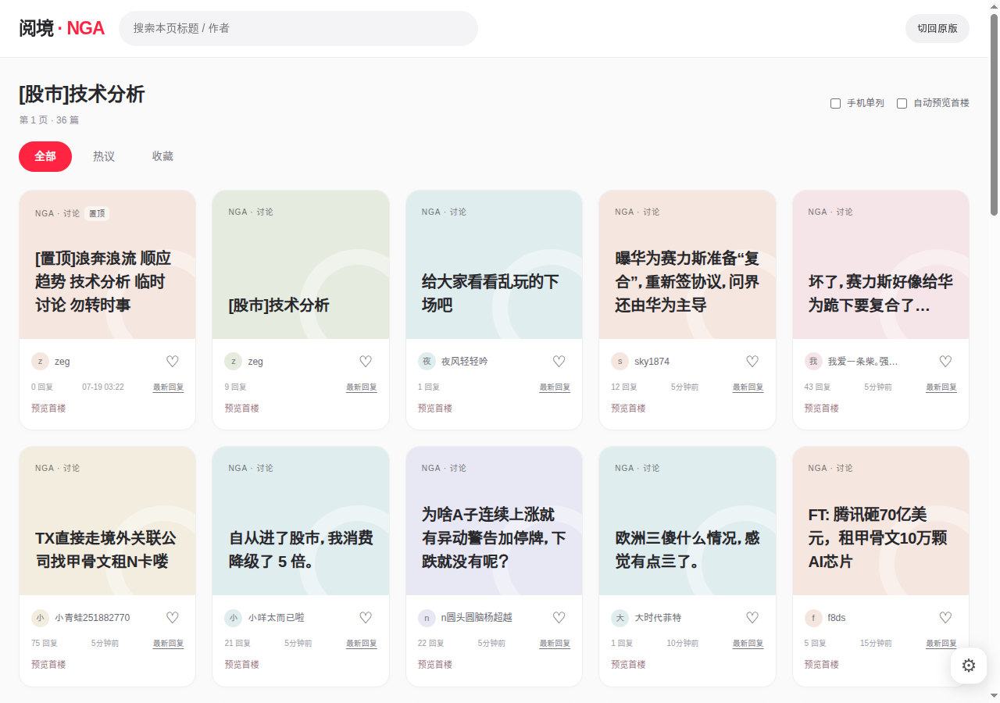

# 远端 Chrome 与油猴开发调试记录

日期：2026-10-01（Asia/Shanghai）。本次完成了跨机器 CDP 连接、远程安装阅境、通过 HTTP 网页更新为开发脚本，以及源码修改后远端页面自动刷新的验证。

## 环境与地址

| 角色 | 本次环境 / 地址 |
| --- | --- |
| 开发机器 | macOS，`192.168.101.105`，运行此仓库及 Node 脚本 |
| 远端浏览器 | Linux，Chrome `146.0.7680.177` |
| 浏览器调试接口 | `http://192.168.101.165:9222` |
| 油猴扩展 | Tampermonkey `5.5.0`，扩展 ID `dhdgffkkebhmkfjojejmpbldmpobfkfo` |
| 网页开发服务 | `http://192.168.101.105:5173`，监听 `0.0.0.0:5173` |
| 阅境版本 | `3.0.0` |
| 本次执行 Node | `v22.18.0`；项目仍建议 Node 24 LTS，至少 `24.15.0` |

这些 IP 是本次局域网环境的记录，不是脚本固定配置。换机器或网络后，应调整 `CDP_URL` 与开发服务的 `--origin`。

## 1. 确认跨机器连接

在开发机器上请求远端接口：

```sh
curl --connect-timeout 4 --max-time 8 http://192.168.101.165:9222/json/version
curl --connect-timeout 4 --max-time 8 http://192.168.101.165:9222/json/list
```

`/json/version` 返回 Chrome 版本、CDP 协议版本 `1.3` 和 `webSocketDebuggerUrl`。`/json/list` 中可看到 NGA 标签页以及 Tampermonkey 的后台页面和 service worker，说明接口可达且扩展已安装。后台目标存在不能证明阅境已安装或具有执行权限。

最初的 `verify-tm.mjs` 写死 `localhost:9222`，`dev-browser.sh` 也先检查本机 Chrome for Testing 文件，无法直接使用现有远端浏览器。修改后：

- `CDP_URL` 指定浏览器地址，默认保留 `http://localhost:9222`。
- 显式指定地址时，启动脚本只检查连接，不启动本机 Chrome。
- 公共 `scripts/cdp.mjs` 负责 HTTP discovery、WebSocket 连接、命令超时与断线处理。
- WebSocket 使用配置的主机和端口，保留 discovery 返回的调试路径，支持浏览器返回回环地址及 SSH 端口转发；不保存临时 target ID。
- 油猴界面未生效时，验证脚本保存截图并以非零状态退出。

```sh
scripts/dev-browser.sh http://192.168.101.165:9222
CDP_URL=http://192.168.101.165:9222 node scripts/verify-tm.mjs
```

第一次验证成功打开 NGA 原站页面，但返回 `host: false, cards: 0, fab: false`，证明网络和 CDP 已工作，阅境尚未生效。

## 2. 远程安装与执行权限

通过 CDP 新开 Tampermonkey 管理页：

```text
chrome-extension://dhdgffkkebhmkfjojejmpbldmpobfkfo/options.html
```

管理页提示 `Please enable the Allow User Scripts extension setting`。随后打开 Chrome 扩展详情：

```text
chrome://extensions/?id=dhdgffkkebhmkfjojejmpbldmpobfkfo
```

在该扩展详情中开启 **Allow User Scripts**。这是这次已安装 Tampermonkey、却仍无法运行脚本的一个原因。

接着在 Tampermonkey 中点击 **Create a new script...**，将本机 `dist/readscape-nga.user.js` 的内容传入远端编辑器，再通过 **File → Save** 保存。该界面使用 CodeMirror；本次最初查找可见的 `button[title="Save"]` 没有找到，因为保存入口位于 File 菜单中。打开菜单并选择 Save 后，管理页显示 `Operation completed successfully`，脚本列表出现已启用的「阅境 · NGA」`3.0.0`。

这里安装的是持久化油猴脚本，不是只在 NGA 页面临时执行一次源码。直接安装使用了本次调试的临时 CDP 工具；仓库目前未提供一键操作 Tampermonkey 编辑器的安装命令。后续更新使用下面的网页链接，不再依赖编辑器内部结构。

再次运行 `verify-tm.mjs`，返回 `host: true, cards: 35, fab: true`，并保存 `1280 × 900` 的页面截图。卡片数量随论坛内容变化。

## 3. 网页安装与开发更新

参考相邻 `nga-monkey-boilerplate` 项目的 `vite-plugin-monkey` 使用流程，提供相同的“开发服务 → 网页链接 → 油猴安装 → 保存源码后刷新”操作方式。本仓库复用已有 Node 单文件构建器，没有引入 Vite，也没有模块 HMR。

启动服务：

```sh
npm run dev -- --host 0.0.0.0 --port 5173 --origin http://192.168.101.105:5173
```

远端 Chrome 访问开发机器的地址：

| 页面 / 接口 | 用途 |
| --- | --- |
| `/` | 安装入口网页 |
| `/__monkey.user.js` | 开发脚本安装 / 更新 |
| `/readscape-nga.user.js` | 正式脚本安装 / 更新 |
| `/__readscape/bundle` | 开发加载器读取当前构建代码与内容哈希 |
| `/__readscape/revision` | 检查构建内容是否变化 |

本次远端浏览器可以访问服务首页。访问 `/__monkey.user.js` 后，Tampermonkey 自动打开 **Userscript re-installation** 页面，显示来源地址和代码变化。确认 **Reinstall** 后，开发加载器替换同名、同 namespace 的正式脚本。

油猴提示重新安装会重置脚本自身的扩展设置；阅境的偏好和收藏使用网站 localStorage，存储机制未变。本次没有专项验证重装前后收藏内容，因此不把它列为本次浏览器实测结论。

开发加载器通过 `GM_xmlhttpRequest` 请求开发服务，包含对应主机的 `@connect` 权限。每次页面加载获取最新构建，之后约每 1.5 秒检查内容哈希，发生变化时刷新页面。服务响应禁用缓存。源码构建失败时接口返回 `503`，当前页面不会因失败构建而刷新；源码修复后继续工作。

更新后运行真实油猴验证，结果为 `host: true, cards: 36, fab: true`。本次开发版页面截图如下：



## 4. 自动刷新与回归验证

为验证真实远端自动刷新，在 `src/core/navigation.js` 末尾临时追加注释，使构建内容哈希改变。通过 CDP 记录 NGA 页面的 `performance.timeOrigin`，观察到它由 `1790847725846.3` 变为 `1790847816798`，且刷新后 `nga-cards-host` 仍存在。该检查没有发送导航或刷新命令，刷新由已安装的开发加载器触发。验证后恢复原文件，确认源码和构建哈希回到原值。

`npm run check` 完成构建、产物语法检查与全部 9 个 Node 测试。新增测试覆盖：

- 远端 CDP 地址校验及 WebSocket 主机、端口和 HTTPS 转换。
- 开发服务的安装元数据、缓存策略、正式脚本不携带开发加载器。
- 开发加载器初次执行，以及发现新内容后调用刷新。
- 在临时项目中修改源码、返回新构建、构建失败返回 `503`，以及修复后的恢复。
- 未公开的文件路径返回 `404`，不支持的写入请求返回 `405`。

调试期间也修正了两个边界问题：转换为默认 HTTPS 端口时需要显式清除原 WebSocket 端口；Bash 中变量紧邻中文分号时使用 `${CDP}`，避免变量名识别错误。远端地址不可达时的退出行为已检查。

## 后续使用与范围

通常运行 `npm run dev`，在远端浏览器点击网页上的开发脚本链接即可。多网卡或端口转发时显式指定 `--origin`；浏览器中的 `localhost` 指浏览器所在机器，不能代替另一台机器的开发服务 IP。

开发期间服务需在线。修改源码会整页刷新，正在编辑的回复可能丢失。结束开发后，从首页安装正式脚本即可独立运行；之后提高包版本并保持更新服务可达，可通过油猴检查正式更新，也可手动再次点击安装链接。

本次完成桌面 Chrome 的实际页面验证。尚未完成真实手机浏览器验证，也未实测 SSH 转发或 HTTPS 部署；这些地址转换行为由自动化测试覆盖。
