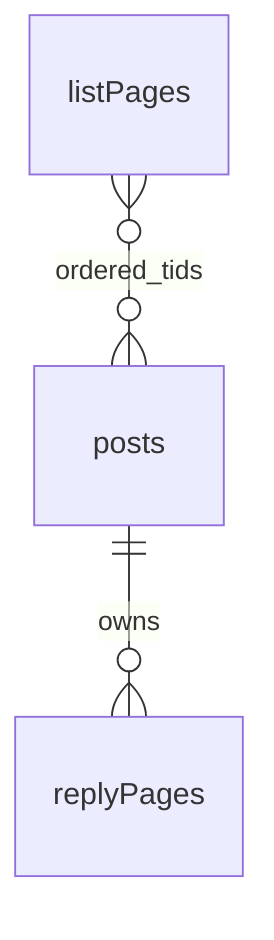

# 本地存储模型

状态：已实现。适用对象：NGA 第三方网站的油猴脚本。数据库版本：3。

## 目标与边界

阅读偏好使用 localStorage；帖子、正文片段、回复页、封面地址、收藏关系及列表分页索引使用 IndexedDB。采用异步存储，避免把大内容同步写入 localStorage。

图片本身不写入数据库，只记录原始地址，复用交给浏览器 HTTP 缓存。这是为了简化存储、去掉配额与下载失败链接，也因此不保证图片离线可用：浏览器缓存被清除、隐私模式结束或图床删除后，封面与正文图片会回退到文字卡或图片占位，重新联网时再取。

不安装 Service Worker，也不接管原站网络请求。脚本只缓存用户已经加载的列表、帖子和回复页；进入网站本身仍需要原站页面和油猴执行环境。这是缓存阅读数据，不是完整离线镜像。自有网站可另行使用 Cache Storage 与 Service Worker；参考 [web.dev：Offline data](https://web.dev/learn/pwa/offline-data?hl=en)。

## 存储布局

数据库名：`${storageKey}-posts`；NGA 为 `nga-cards-v1-posts`。同源页面和后台阅读容器共享一个服务，不同 NGA 域名分别存储。

| 位置 / 表 | 主键 | 内容 | 索引 |
| --- | --- | --- | --- |
| localStorage：`nga-cards-v1` | 设置键 | 主题、字体、字号、布局、导航开关、缓存开关和帖子上限 | 无 |
| `posts` | `tid` 字符串 | 标题、作者、UID、列表元数据、首楼 `contentHtml`、封面地址 `coverId`、`updatedAt`、`lastAccess` | `lastAccess` |
| `replyPages` | `[tid, page]` | 页码、该页楼层快照、分页状态 `next`、标题、来源地址、`cachedAt` | `tid` |
| `relations` | `id` | 收藏状态与书签快照 | `tid`、`kind` |
| `listPages`（列表索引） | `streamKey#number` | 板块与筛选条件、页码、来源地址、下一页地址、有序 `tids`、`cachedAt` | `streamKey` |

`tid` 只接受数字标识。封面 `coverId` 是完整 HTTP(S) 图片地址，移除 fragment、保留查询参数，指向原站点或 NGA 图床；图片字节不落库，因此不做内容哈希，也不占用脚本的存储预算。

### 封面与收藏

封面：`posts.coverId` 保存首楼第一张正文贴图地址。首图选择排除引用和表情中的图片，包含首楼自身的折叠块与表格图片；地址以完整 URL 去重。

收藏：`relations` 中 `id = favorite:${tid}`、`kind = favorite`，包含 `savedAt` 和标题、作者、地址等轻量 `snapshot`。收藏书签可以独立于帖子缓存存在，不保存正文或图片。

### 回复页快照

每层记录楼层键、PID、楼层号、作者、资料、时间、引用关系、来源地址、原楼地址、回复与引用地址，以及 `html` 正文片段。DOM 节点和事件处理函数不进入数据库，也不保存整页 HTML、原站脚本、登录凭据或 Cookie。

`posts.contentHtml` 存首楼正文；第一页楼层快照可能也包含首楼。该少量重复允许回复页独立恢复，并计入文字预算。

缓存 HTML 始终作为不可信数据处理：用 DOMParser 在惰性文档中解析，验证来源和元数据地址，再通过现有正文过滤器重建界面；脚本、事件属性和危险协议不执行。未登录时继续隐藏回复与引用操作。

## 读写流程

1. 原站列表仍是当前页的数据源。解析后保存帖子字段与有序列表索引；缓存的后续连续页异步追加，复用当前卡片节点。
2. 首次打开帖子或加载回复页时，保存已解析楼层快照；首楼第一张非引用正文图片的地址另外登记为封面。图片不下载、不落盘。封面登记会同步写一条 localStorage pending 日志；页面在 IndexedDB 事务提交前被刷新或关闭时，下次加载据此回填封面并清理日志，避免"刷新后封面消失"。
3. 列表封面与正文图片直接引用原图地址，由浏览器 HTTP 缓存复用。NGA 图床实测不防盗链（带站内 Referer 正常返回），但可能不返回 `cache-control`，浏览器按 `last-modified` / `etag` 启发式缓存并重新验证。
4. 后续回复页优先使用缓存的楼层快照，界面标注“来自本地缓存”。缓存页不会自动后台刷新；再次进入对应原页时，原站数据会更新该页快照。
5. 原页暂时无法解析正文时，可以显示该页已有缓存。未缓存的内容仍由原站获取；原站页面完全无法加载时，油猴本身无法提供独立入口。

## 生命周期与容量

| 项目 | 默认值 | 可配置范围 |
| --- | --- | --- |
| 缓存帖子数 | 500 | 1–500 |
| 文字及索引预算 | 500 MiB | 固定 |
| 未访问过期时间 | 30 天 | 固定 |
| 定期检查 | 30 分钟 | 固定 |

`lastAccess` 表示打开帖子或访问已展示的列表内容；读取统计数据和查询缓存不会续期。

`cachedAt` 是回复页抓取时间；读取缓存不会把它改为当前时间。`updatedAt` 是脚本保存或更新帖子字段的时间，不等同于服务器的编辑时间。

启动后通过 requestIdleCallback（不支持时延后 1 秒）异步清理，以后每 30 分钟再检查。清理仅在脚本运行时执行；关闭网页期间不运行，重新进入时再检查。

删除一个帖子时，在同一事务中删除它的正文、回复页和列表索引中的引用。收藏关系与书签保留，不为正文提供永久保留豁免。达到帖子数或文字预算时，按帖子 `lastAccess` 从旧到新淘汰。

## 设置面板与一键清理

设置面板展示缓存总量估算、帖子数量、回复页数量和帖子上限。文字与索引按 JSON 字符数 × 2 保守估算，不含收藏书签和数据库内部索引、页分配等开销，不代表浏览器整站磁盘占用。图片由浏览器缓存承担，不计入脚本统计。

缓存设置可关闭缓存或调整帖子上限；关闭缓存停止新的缓存读写，已有缓存可继续手动清理，重新开启可恢复使用。收藏读写独立于缓存开关。

“清理缓存”直接清空帖子、回复页和列表索引，并删除图片关系；保留收藏关系和 localStorage 中的阅读偏好。按钮操作期间禁用，显示进度、成功或失败状态。

清理不会卸载当前阅读界面或重设滚动位置。当前内存内容可继续阅读；清理后再次主动浏览时可以产生新缓存。同源后台阅读容器共用队列和 generation。其他标签页在支持 BroadcastChannel 时同步清理、用量与收藏事件；事务保证已提交数据一致。

## 事务与迁移

缓存修改统一通过 readwrite 事务提交，覆盖所有业务表；事务完成后才通知界面。

数据库 1 → 3：版本 1 用逐帖 `images` 存封面字节，升级时把每帖首图折算为 `posts.coverId`（仅地址）并删除 `images` 表；版本 2 的 `resources` Blob 表与逐图 `relations` 一并删除，图片改由浏览器缓存。升级失败时事务回滚。

旧 `nga-cards-v1-list-cache` 和 `nga-cards-v1-favorites` 在数据库就绪后迁入帖子、列表索引和收藏关系。成功提交后才删除旧 localStorage 键；失败时保留原数据，供以后再次尝试。版本 1 从未缓存的正文不会被迁移伪造。

数据库被旧标签页阻挡升级、浏览器禁止 IndexedDB 或迁移失败时，界面保留在线阅读能力，缓存状态显示不可用。单次写入失败会回滚该事务，读取不到缓存时使用在线资源；清理失败会在设置面板提示。旧连接收到 versionchange 后关闭；必要时关闭旧版标签页并刷新。

## Review 注意点

- 图片不进入本地缓存：清除浏览器缓存、隐私模式结束或图床删除后，封面与正文图片需要重新联网获取，界面会回退到文字卡或图片占位。
- 数据按浏览器 origin 隔离，不自动跨 NGA 镜像域名同步。
- 默认缓存属于浏览器的普通可清除站点数据，未申请永久存储权限。
- 正文快照属于该浏览器本地数据，没有按 NGA 登录账号分库；注销不等于清空已读内容。共享浏览器场景可使用“清理缓存”。
- 收藏书签独立保留，不计入缓存预算；大量收藏仍会使用少量站点空间。
- 修改正文安全过滤器时，需要同时验证在线正文和缓存快照路径。

## 验证入口

运行 `npm run check`：构建、生成脚本语法检查和全部 DOM / IndexedDB 回归测试。

重点测试位于 `tests/storage-model.test.cjs`、`tests/post-cache.test.cjs`、`tests/list-pagination.test.cjs`：旧数据迁移、封面地址复用、回复页重用、缓存 HTML 安全重建、过期与容量删除、一键清理保留收藏、设置面板统计与上限保存、瀑布流节点及滚动位置保留。